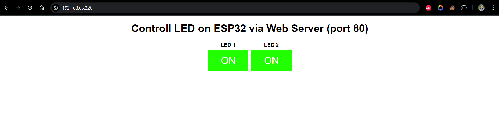

# Controll ESP32 via Web Server (Port 80)

## Description
This porject using ESP32 as uC to controll 2 different LED via web server or port 80 (HTTP). User can access the web server via browser but before use it make sure ESP32 and Browser on the same network.

## How to use
1. Follow the wiring bellow
2. On the code change SSID and Password to your network WiFi
3. Upload the code to ESP32
4. Open serial monitor to ESP32 to get IP Address
5. Copy paste the IP Address to your browser
6. You can controll the LED now via port 80

## Wiring Diagram
| ESP32     | LED 1    | LED 2    |
| --------|---------|---------|
| 26  | +   |    |
| 27  |  | + |
| GND  | - | - |

## Serial Monitor To Get IP Address

## Dashboard Controll LED

## Dashboard After Push The LED Button

****************************************************
Created March 2022 By Andi Saputra IG : @andi21262